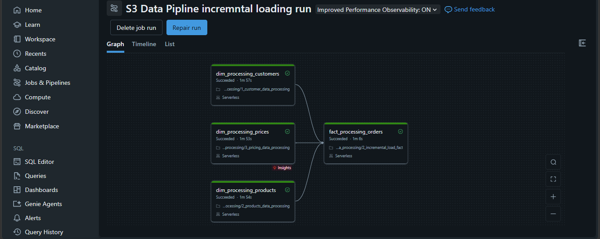
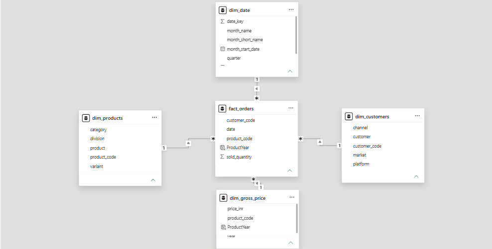
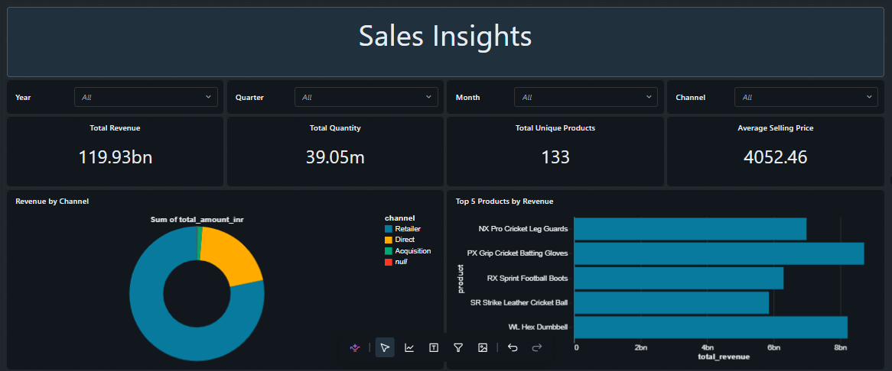
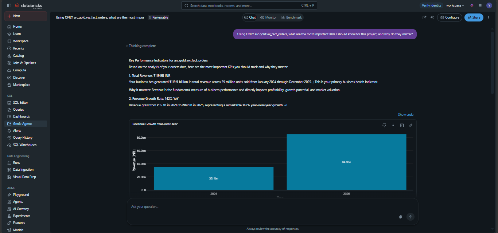

## Databricks Workflow



The captured workflow shows customer, pricing, and product tasks feeding the incremental orders task. All four tasks completed successfully in the displayed run.

The dimension tasks use their existing full-refresh notebooks even when included in the incremental orders workflow. Their presence in that job does not make dimension processing incremental.

For an initial deployment, run products before pricing because pricing reads `fmcg.silver.products`. The screenshot shows those tasks in parallel, so reproducing that arrangement assumes the product table is already available. Configure an explicit product-to-pricing dependency when the price task must use the products refreshed in the same run.

The repository includes notebooks and workflow evidence, but no exported job definition; configure task dependencies in the target Databricks workspace.

## Analytical Model



The consolidated reporting model centers on `fact_orders` and uses four dimensions:

| Table | Reporting purpose |
| --- | --- |
| `fact_orders` | Monthly sold quantity by product and customer |
| `dim_date` | Month, quarter, and year filtering |
| `dim_customers` | Customer, market, platform, and channel analysis |
| `dim_products` | Product, category, division, and variant analysis |
| `dim_gross_price` | Product pricing by year |

The Power BI screenshot shows a `ProductYear` relationship for pricing. The enriched SQL view expresses the same product-and-year lookup using `product_code` and `YEAR(date)`.

The serving query in [denormalise_table_query_fmcg.txt](project-de-fmcg-atlikon/2_dashboarding/denormalise_table_query_fmcg.txt) creates `fmcg.gold.vw_fact_orders_enriched`. It left-joins the monthly fact to the dimensions and calculates:

```sql
fo.sold_quantity * gp.price_inr AS total_amount_inr
```

This produces a reporting surface with date attributes, customer segments, product attributes, quantities, and gross-price-based sales amounts. Missing price matches result in null calculated amounts, so pricing coverage matters when interpreting revenue.

## Sales Dashboard



The Sales Insights dashboard presents the consolidated business through:

- Total revenue, total quantity, unique products, and average selling price cards.
- Revenue by channel, including the acquisition channel.
- The top five products by revenue.
- Year, quarter, month, and channel filters.

The captured dashboard displays approximately INR 119.93 billion in revenue, 39.05 million units, and 133 unique products. These are values from the saved screenshot, not live results or a fresh execution of the repository.

The screenshot also includes an average selling price card. Its measure definition is not included in the supplied notebooks or SQL, so its exact aggregation should be checked in the original dashboard before reuse.

A separate dashboard export is available in [fmcg_dashboard.pdf](project-de-fmcg-atlikon/2_dashboarding/fmcg_dashboard.pdf).

## Databricks Genie Analysis



The Genie screenshot demonstrates natural-language exploration of the project's reporting data, including revenue and year-over-year comparisons. This complements the dashboard by letting users ask business questions about the consolidated data.

The screenshot references an `arc` view from the captured environment. When reproducing the project, connect Genie to the reporting view created in your own catalog and verify generated calculations against that view.

The saved analysis is available in [genie_kpi_summary.pdf](docs/genie_kpi_summary.pdf).

## Repository Structure

```text
.
|-- README.md
|-- docs/
|   |-- images/
|   |   |-- data_platform_architecture.png
|   |   |-- aws_s3_data_landing.png
|   |   |-- databricks_pipeline_workflow.png
|   |   |-- power_bi_data_model.png
|   |   |-- sales_analytics_dashboard.png
|   |   `-- databricks_genie_kpi_analysis.png
|   `-- genie_kpi_summary.pdf
`-- project-de-fmcg-atlikon/
    |-- 0_data/
    |   |-- 1_parent_company/
    |   |   |-- full_load/
    |   |   `-- incremental_load/
    |   `-- 2_child_company/
    |       |-- full_load/
    |       `-- incremental_load/
    |-- 1_codes/
    |   |-- 1_setup/
    |   |-- 2_dimension_data_processing/
    |   `-- 3_fact_data_processing/
    |-- 2_dashboarding/
    `-- resources/
```

## Running the Project

Use a Databricks environment with PySpark, Delta Lake, catalog permissions, and access to the configured S3 locations. S3 access must support reading incoming files and moving them to the archive. The notebooks use Databricks-specific APIs such as `dbutils`, notebook widgets, and `%run`.

1. Import `1_codes/` into your Databricks workspace. Update the `%run /Workspace/consolidated_pipeline/1_setup/utilities` references if your import location differs.
2. Replace the hardcoded S3 bucket paths. Use `fmcg` consistently, or update all catalog references, including hardcoded SQL and staging cleanup statements; changing the widget alone is insufficient.
3. Run `setup_catalog.ipynb` and import the four parent full-load CSVs into the Gold Delta tables listed above, using date and numeric types appropriate to their columns.
4. Run `dim_date_table_creation.ipynb`. Extend its date range if your reporting periods go beyond the supplied dataset.
5. Upload the child customer, product, and gross-price files into their respective S3 folders, and historical order files into `orders/landing/`.
6. Run the customer and product notebooks, followed by the pricing notebook, then `1_full_load_fact.ipynb`.
7. Upload the next child order batch into `orders/landing/` and run `2_incremental_load_fact.ipynb`.
8. Run the `fmcg` enriched-view SQL, configure the reporting connections, and refresh the dashboard after successful consolidation.

When validating a run, compare affected monthly totals in child Gold with their matching parent fact rows, inspect unmatched product and pricing keys, and confirm staging cleanup. The notebooks contain interactive row counts and previews; an automated end-to-end test suite is not included.

Because files are archived before downstream completion, a failed Silver or Gold step requires deliberate recovery from retained tables or archived files. Rerunning with an empty landing folder is not a complete recovery procedure. The implementation also does not propagate source deletions.

## Scope Notes

1. **Incremental processing focuses on `fact_orders`.** This project's incremental implementation targets the child's order facts. Customers, products, and prices use full-refresh processing followed by parent merges. Incremental loading for those datasets would be a separate case requiring its own change-detection rules and update handling.

2. **Parent incremental loading is simplified for this demonstration.** The supplied parent SQL uses a direct `COPY INTO` query to load additional parent order data. This is a shortcut, not a complete production parent incremental pipeline. The project's main case is integrating and incrementally processing the acquired child's data; building the parent's own incremental ingestion pipeline was outside that scope. The sample query also requires replacing its volume-path placeholder and aligning its `arc` catalog reference with the chosen environment.
