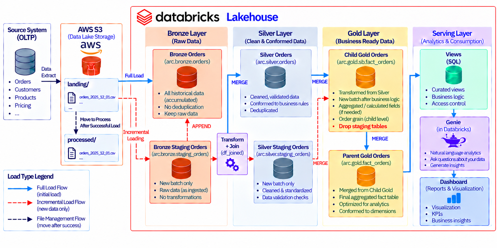
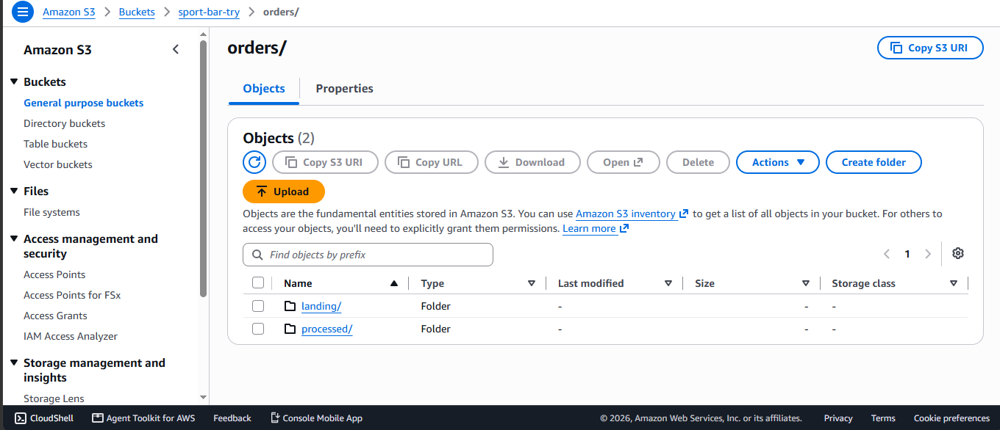

# FMCG Full Data Platform — Parent & Child Company Data Integration

## Overview

This project implements a data platform on **Databricks** for an FMCG (Fast-Moving Consumer Goods) business that recently went through a **company acquisition**. The business scenario is as follows:

- The organization operates as a **parent company**, with an existing, established data platform (sales, orders, products, customers, etc.).
- The parent company **acquired a child company**, which has its own operational data (its own orders, sales records, and related tables).
- The business requirement is to **continuously enrich the parent company's data with the child company's data**, so that whenever the child company produces **new data**, it is picked up, processed, and merged into the parent's unified data platform — without reloading everything from scratch each time.

In short: two data sources (parent + child), one unified data platform, and a mechanism to keep the parent's data current as new child data arrives.

This README walks through the architecture, the data flow from landing to persistent storage, the load strategy (full load vs. incremental load), and the reporting/analytics layer built on top of the platform.

---

## Architecture

The diagram below shows the end-to-end architecture of the platform, from data sources through Databricks processing layers to the reporting layer.

At a high level, the platform follows a standard multi-layer (medallion-style) approach:

- Raw data from both the parent and child companies is ingested and stored first.
- The data then moves through processing layers inside Databricks, where it is cleaned, standardized, and modeled.
- The final, modeled data is exposed to Power BI for reporting and to Databricks Genie for natural-language KPI exploration.

---

## Data Landing & Persistence (Amazon S3)

Data ingestion starts on **Amazon S3**, which acts as the storage layer for both the landing zone and the persistent (raw historical) zone.

The flow works as follows:

1. **Landing Zone** — Every time new files (from the parent or the child company) are delivered, they are first placed in the S3 landing zone. This zone is meant to hold newly arrived, unprocessed files temporarily.
2. **Persistent Zone** — Once a load job picks up the files from the landing zone, the data is validated and moved into the persistent zone, where it is kept as the durable, historical raw copy of the data. This ensures that every file that has ever been received is retained and traceable, even after it has been processed further downstream in Databricks.

This separation between landing and persistent storage keeps the ingestion process clean: the landing zone is only a temporary drop point, while the persistent zone is the long-term source of truth for raw data.

---

## Data Loading Strategy

Once data is available in S3, it is loaded into Databricks using two different strategies depending on the situation: **Full Load** and **Incremental Load**.

### Full Load

The full load process is used the first time a dataset is brought into the platform (or whenever a complete refresh is required). It works as follows:

- The entire dataset (parent or child) is read from the persistent zone in S3.
- The data is cleaned and transformed according to the platform's data model.
- The transformed dataset is written to the target tables in full, replacing any previous version.

This is a straightforward, one-time (or on-demand) operation and does not need to track what has changed — it simply loads everything.

### Incremental Load

The incremental load process is used for ongoing, recurring updates, and is the core mechanism that keeps the parent company's data up to date with new data coming from the child company. It follows these steps:

1. **Identify new data** — The pipeline checks the child company's source for records that have arrived since the last successful load (typically based on a timestamp, date column, or load watermark).
2. **Extract and stage** — Only the newly identified records are extracted from S3 and staged in a working/temporary table inside Databricks.
3. **Transform** — The staged records go through the same cleaning and standardization logic used in the full load, so that they are consistent with the existing parent data model.
4. **Merge into the target table** — The transformed, staged records are merged (upserted) into the parent's target table using a merge/matching key, so that new records are inserted and any updated records are reflected correctly, without duplicating or reloading the data that already exists.

This way, every time the child company produces new data, only that new data is processed and merged into the parent's platform, keeping the pipeline efficient and scalable.

---

## Reporting & Analytics

Once the data is modeled inside Databricks, it is exposed to the reporting layer through Power BI, and also made available for natural-language exploration through Databricks Genie.

### Power BI Data Model

The modeled tables from Databricks are connected to Power BI, where a structured data model (fact and dimension tables) is built to support the analytics layer.

### Sales Analytics Dashboard

On top of the data model, a Sales Analytics Dashboard was built in Power BI to give business users visibility into sales performance, orders, and other key business metrics across both the parent and child company data.

### Databricks Genie — KPI Analysis

In addition to the Power BI dashboard, Databricks Genie was used to allow business users to ask natural-language questions directly against the modeled data and get KPI answers without needing to write SQL or navigate a dashboard.

---

## Notes

- In this project, the incremental load logic was implemented specifically for the **Fact Orders** table coming from the child company, since that was the focus of this use case. Extending incremental loading to other tables would need to be handled as a separate, dedicated case.
- The incremental load implemented on the **parent** side was done using a simple, regular query rather than a more robust change-data-capture/merge-based approach. This is not the ideal long-term design, but it was acceptable here because the parent side was not the actual focus of this case — the core requirement was updating the parent's data with the **child** company's new data.
